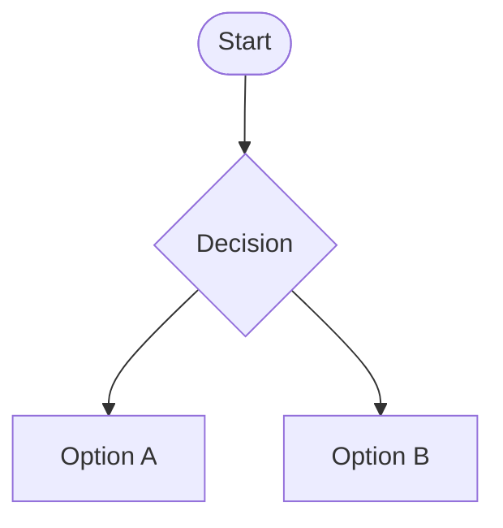

# Git Sandbox

Play around with git, commit, revert and merge all you want. Create PRs and approve them!

## Resources

Here are some resources to learn more about git.

- [Github's OnDemand Course](https://services.github.com/on-demand/intro-to-github/)
- [Managing Merge Conflicts](https://services.github.com/on-demand/merge-conflicts/)
- [Trouble shooting](https://services.github.com/on-demand/git-trouble/)
- [learngitbranching](https://learngitbranching.js.org/)
- One here

Here are some nice git cheat sheets.

- [Jan Krueger Git Cheat Sheet](https://jan-krueger.net/wordpress/wp-content/uploads/2007/09/git-cheat-sheet.pdf)
- [Atlassian Git Cheat Sheet](https://www.atlassian.com/git/tutorials/atlassian-git-cheatsheet)

Here is a great system for writing good commit messages.

- [Git Commit Guidelines](https://github.com/angular/angular.js/blob/master/DEVELOPERS.md#commits)
- Another here

_Remember though, this repo is public. :)_

## Contributing

If you want to contribute, please fork the repo and create a pull request.

I want to add many lines to a file

## Diagram

